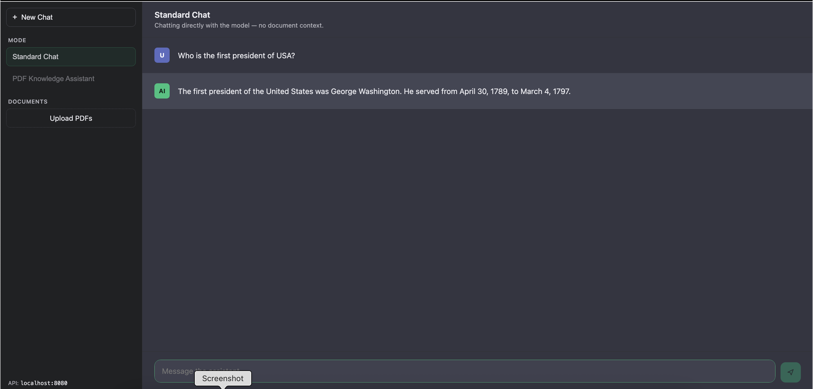
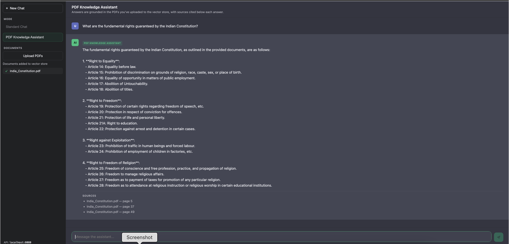
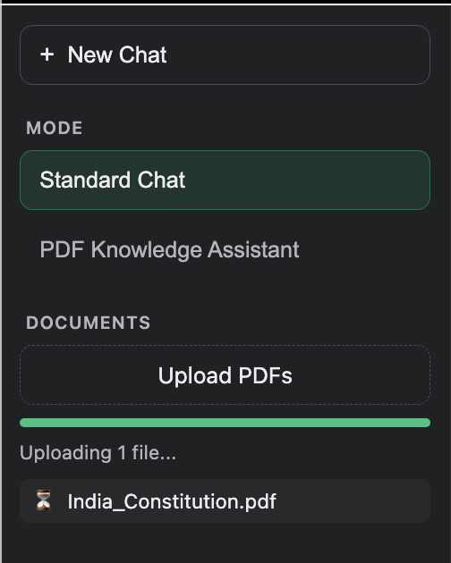

# PDF Knowledge Assistant

Spring Boot + Spring AI app that exposes a chat API (plain and RAG-over-PDFs) backed by an in-memory vector store, plus a ChatGPT-style web UI.

## Running

```
./gradlew bootRun
```

The app starts on **http://localhost:8080**. The UI is served automatically at that same address (`src/main/resources/static/`) — just open http://localhost:8080 in a browser.

## Screenshots

### Standard Chat


### PDF Knowledge Assistant (RAG with sources)


### Document upload in progress


## UI features

- **Standard Chat** mode — talks directly to the model (`POST /chat`).
- **PDF Knowledge Assistant** mode — RAG over your uploaded PDFs (`POST /chat/rag`), with a **Sources** list (file + page) shown under each answer.
- **Upload PDFs** from the sidebar — files are chunked, embedded, and added to the in-memory vector store (`POST /documents`). A non-blocking progress bar shows upload status; you can keep chatting while an upload is in progress.
- Mode is locked once you send your first message in a chat — start a **New Chat** to switch between Standard Chat and Knowledge Assistant.
- Stateless: each question is sent independently, no conversation history is kept server-side.

Note: the vector store is in-memory only — uploaded documents are lost on app restart.

## API endpoints

| Method | Path         | Body                                                  | Response                                                          |
|--------|--------------|--------------------------------------------------------|--------------------------------------------------------------------|
| POST   | `/chat`      | `{"q": "..."}`                                          | plain text answer                                                  |
| POST   | `/chat/rag`  | `{"q": "..."}`                                          | `{"answer": "...", "sources": [{"file": "...", "page": 1}, ...]}`  |
| POST   | `/documents` | multipart form, repeatable `files` field (PDFs only)    | `{"message": "...", "filesProcessed": N, "chunksAdded": N}`        |

`/chat/rag`'s `sources` are the actual document chunks retrieved from the vector store for that question (deduped by file + page) — not something the model is asked to guess, so they're always accurate to what was fed into the prompt.

A Postman collection (`src/main/resources/postman-collection/pdf-knowledge-assistant.postman_collection.json`) is included for testing these directly.

## Environment

Set your OpenAI API key before starting the app:

```
export OPENAI_API_KEY=sk-...
```
